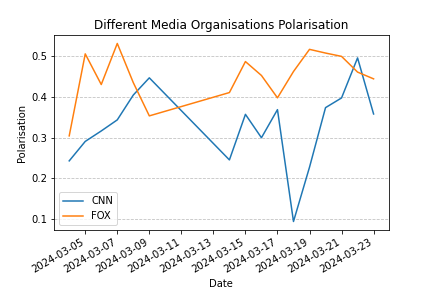
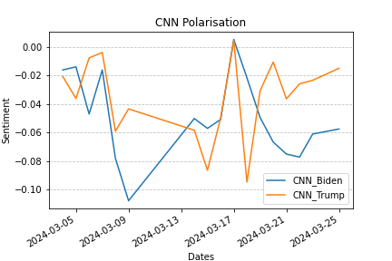
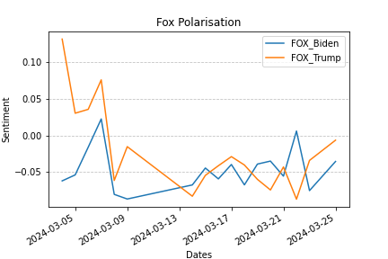
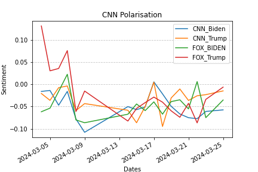

# Political Polarisation

Measuring the political polarisation of media organisations over time.

## Cosine Similarity Absolute Difference Figure

## Absolute distance CNN

## Absolute distance Fox

## Combined Distance

